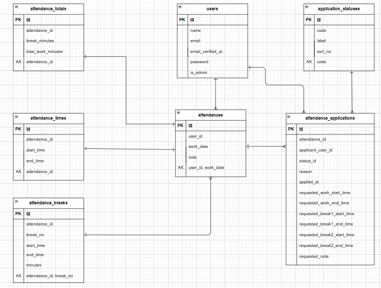

# 勤怠管理システム（attendance_system）

Laravel + Docker（Nginx / PHP / MySQL）で動く勤怠管理アプリです。
一般ユーザーの勤怠登録・修正申請、管理者の承認などを想定しています。

---

## テストアカウント
- name: 一般ユーザー
- email: test@example.com
- password: password123
-------------------------
- name: 管理者ユーザー
- email: admin@example.com
- password: admin1234
-------------------------


## 環境構築

- 一般ユーザーログイン画面 http://localhost/login
- 会員登録画面　http://localhost/register
- 管理者ログイン画面 http://localhost/admin/login

### Dockerビルド

```
git clone https://github.com/simanuki0923/attendance_system.git
cd attendance_system
docker compose up -d --build

```

### Laravel環境構築

```
sudo chmod -R 777 src/*
cp src/.env.local src/.env
sudo chmod -R 777 src/.env
docker-compose exec php bash
composer install
php artisan key:generate
php artisan migrate
php artisan db:seed
exit

```

---

## メール認証
mailtrapというツールを使用しています。<br>
以下のリンクから会員登録をしてください。　<br>
https://mailtrap.io/

メールボックスのIntegrationsから 「laravel 7.x and 8.x」を選択し、　<br>
.envファイルのMAIL_MAILERからMAIL_ENCRYPTIONまでの項目をコピー＆ペーストしてください。　<br>
MAIL_FROM_ADDRESSは任意のメールアドレスを入力してください。

## テーブル仕様

## users テーブル
| カラム名 | 型 | primary key | unique key | not null | foreign key |
|---|---|---|---|---|---|
| id | bigint | PK |  | ○ |  |
| name | string(100) |  |  | ○ |  |
| email | string |  | UNIQUE | ○ |  |
| email_verified_at | timestamp |  |  |  |  |
| password | string |  |  | ○ |  |
| is_admin | boolean default false |  |  | ○ |  |
| remember_token | string(100) |  |  |  |  |
| created_at | timestamp |  |  | ○ |  |
| updated_at | timestamp |  |  | ○ |  |

---

## attendances テーブル

| カラム名 | 型 | primary key | unique key | not null | foreign key |
|---|---|---|---|---|---|
| id | bigint | PK |  | ○ |  |
| user_id | bigint |  | UNIQUE(user_id, work_date) | ○ | users(id) |
| work_date | date |  | UNIQUE(user_id, work_date) | ○ |  |
| note | text |  |  |  |  |
| created_at | timestamp |  |  | ○ |  |
| updated_at | timestamp |  |  | ○ |  |

---

## attendance_times テーブル

| カラム名 | 型 | primary key | unique key | not null | foreign key |
|---|---|---|---|---|---|
| id | bigint | PK |  | ○ |  |
| attendance_id | bigint |  | UNIQUE | ○ | attendances(id) |
| start_time | time |  |  |  |  |
| end_time | time |  |  |  |  |
| created_at | timestamp |  |  | ○ |  |
| updated_at | timestamp |  |  | ○ |  |

---

## attendance_breaks テーブル

| カラム名 | 型 | primary key | unique key | not null | foreign key |
|---|---|---|---|---|---|
| id | bigint | PK |  | ○ |  |
| attendance_id | bigint |  | UNIQUE(attendance_id, break_no) | ○ | attendances(id) |
| break_no | unsignedTinyInteger |  | UNIQUE(attendance_id, break_no) | ○ |  |
| start_time | time |  |  |  |  |
| end_time | time |  |  |  |  |
| minutes | unsignedInteger default 0 |  |  | ○ |  |
| created_at | timestamp |  |  | ○ |  |
| updated_at | timestamp |  |  | ○ |  |

---

## attendance_totals テーブル

| カラム名 | 型 | primary key | unique key | not null | foreign key |
|---|---|---|---|---|---|
| id | bigint | PK |  | ○ |  |
| attendance_id | bigint |  | UNIQUE | ○ | attendances(id) |
| break_minutes | unsignedInteger default 0 |  |  | ○ |  |
| total_work_minutes | unsignedInteger default 0 |  |  | ○ |  |
| created_at | timestamp |  |  | ○ |  |
| updated_at | timestamp |  |  | ○ |  |

---

## application_statuses テーブル

| カラム名 | 型 | primary key | unique key | not null | foreign key |
|---|---|---|---|---|---|
| id | bigint | PK |  | ○ |  |
| code | string(50) |  | UNIQUE | ○ |  |
| label | string(50) |  |  | ○ |  |
| sort_no | unsignedInteger default 1 |  |  | ○ |  |
| created_at | timestamp |  |  | ○ |  |
| updated_at | timestamp |  |  | ○ |  |

---

## attendance_applications テーブル

| カラム名 | 型 | primary key | unique key | not null | foreign key |
|---|---|---|---|---|---|
| id | bigint | PK |  | ○ |  |
| attendance_id | bigint |  |  | ○ | attendances(id) |
| applicant_user_id | bigint |  |  | ○ | users(id) |
| status_id | bigint |  |  | ○ | application_statuses(id) |
| reason | text |  |  | ○ |  |
| applied_at | datetime |  |  | ○ |  |
| requested_work_start_time | time |  |  |  |  |
| requested_work_end_time | time |  |  |  |  |
| requested_break1_start_time | time |  |  |  |  |
| requested_break1_end_time | time |  |  |  |  |
| requested_break2_start_time | time |  |  |  |  |
| requested_break2_end_time | time |  |  |  |  |
| requested_note | text |  |  |  |  |
| created_at | timestamp |  |  | ○ |  |
| updated_at | timestamp |  |  | ○ |  |
---

## ER図


```

## PHPUnitテスト
---

docker compose exec php bash
php artisan test tests/Feature

```
